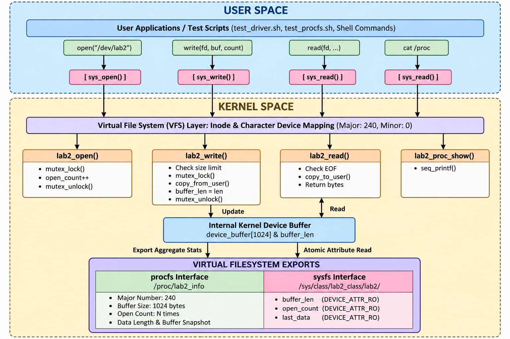
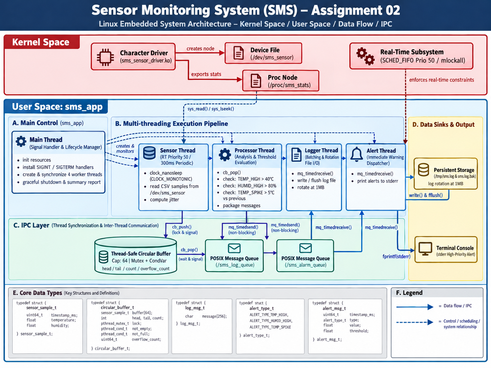

# FPT University - Linux and Open Source Platform (LOS201)

[](https://kernel.org)
[](https://developer.arm.com)
[](https://www.qemu.org)
[](https://en.wikipedia.org/wiki/C_(programming_language))

This repository contains all experimental deliverables, kernel source modifications, driver implementations, configurations, and formal technical reports for **Linux and Open Source Platform (LOS201)** at **FPT University - Ho Chi Minh City Campus**.

---

## 👥 Engineering Team Members

| Full Name | Roll Number |
| :--- | :---: |
| **Hoàng Ngọc Gia Bão** | **SE203238** |
| **Trần Hồ Khánh Tân** | **SE203740** |
| **Nguyễn Trọng Hùng** | **SE204352** |
| **Nguyễn Quế Vũ** | **SE204290** |
| **Nguyễn Việt Anh** | **SE204364** |
| **Hồ Phan Anh Tuấn** | **SE203437** |

- **Supervising Lecturer:** Mr. Phạm Thế Vinh

---

## 📂 Repository Structure

- **`lab01_kernel_boot/`**: Linux Kernel Configuration & System Boot on ARMv7 Architecture.
  * `configs/`: Linux Kernel and BusyBox configuration files (`kernel.config`, `busybox.config`).
  * `rootfs/`: Minimal BusyBox-based initramfs root filesystem used for the ARMv7 Linux boot process.
    * `initramfs/`: Root filesystem containing system initialization scripts, runtime mount points, and BusyBox userspace directories.
      * `etc/`: System initialization configuration including `inittab` and `init.d/rcS`.
      * `dev/`, `proc/`, `sys/`: Device and virtual filesystem mount points used during system startup.
      * `bin/`, `sbin/`, `usr/bin/`, `usr/sbin/`: Userspace executable directories.
  * `output/`: Generated boot artifacts including Linux kernel image (`zImage`), Device Tree Blob (`vexpress-v2p-ca9.dtb`), and compressed initramfs image (`initramfs.cpio.gz`).
  * `report/`: Formal technical PDF laboratory report (`Lab01.pdf`).
- **`lab02_device_driver/`**: Writing Character Device Drivers & Flash Filesystem Management.
  * `driver/`: Kernel module source (`lab2_driver.c`), `Makefile`, and compiled ARM binary (`lab2_driver.ko`).
  * `rootfs/`: BusyBox initialization scripts (`inittab`, `rcS`) and userspace validation suites (`test_driver.sh`, `test_procfs.sh`).
  * `logs/`: Verifiable raw execution terminal logs (`boot_log.txt`, `driver_test.txt`, `procfs_test.txt`, `mtd_jffs2.txt`).
  * `docs/`: Architectural schematics and system design diagrams.
  * `report/`: Formal technical PDF laboratory report (`SE203238_Lab02_BaoCao.pdf`).
- **`lab03_open_source/`**: Open Source Development Workflow & Community Contribution.
- **`assignment01/`**: Advanced Linux Architecture & System Programming.
  * `task1_ioctl/`: Source code for extending the LAB-02 character device driver with four IOCTL commands.
  * `task2_misc/`: Source code for implementing a counter device using the Linux miscellaneous device framework.
  * `logs/`: Test outputs and kernel logs.
  * `docs/`: Driver architecture diagrams and supporting documentation.
  * `report/`: Final technical report in PDF format (`Asgn01.pdf`).
- **`assignment02_sensor_monitoring/`**: Real-Time Multi-Threaded Sensor Monitoring System (SMS).
  * `driver/`: Kernel character device driver simulating environmental sensor hardware (`sms_sensor_driver.c`).
  * `app/`: Multi-threaded POSIX real-time application source (`sms_app.c`, `circular_buffer.c`, worker threads).
  * `logs/`: Profiling and tracing outputs (`valgrind_leak.txt`, `strace_sms.txt`, `perf_sms.txt`).
  * `docs/`: System architecture diagram and 13 experimental verification screenshots.
  * `report/`: Formal technical engineering reports (`REPORT.docx`, `assignment 2.pdf`).
- **`.gitignore`**: High-performance Git filter excluding raw multi-gigabyte kernel build trees and object artifacts.

---

## 🔬 Lab 01: Linux Kernel Configuration & System Boot on ARMv7

### 1. Architectural Overview & System Flow

LAB 01 focuses on configuring, building, and booting an Embedded Linux system for the ARMv7-A Cortex-A9 architecture using QEMU `vexpress-a9`.

The complete boot flow consists of Linux Kernel configuration and cross-compilation, U-Boot bootloader preparation, BusyBox root filesystem construction, initramfs packaging, and final Linux system boot on QEMU.


### 2. Comprehensive Technical Highlights

- **Linux Kernel Configuration & Cross-Compilation:**
  * Configured Linux Kernel `5.15.0 LTS` for the ARMv7-A Cortex-A9 platform.
  * Used the `arm-linux-gnueabihf-` cross-compilation toolchain to build the kernel for ARM.
  * Started from the `vexpress_defconfig` configuration for the QEMU Versatile Express platform.
  * Enabled the required kernel features for initramfs support and the PL011 UART serial console.
  * Generated the ARM kernel image `zImage` and the Device Tree Blob `vexpress-v2p-ca9.dtb`.

- **U-Boot Bootloader:**
  * Configured U-Boot for the `vexpress_ca9x4` platform.
  * Built and executed U-Boot on the QEMU `vexpress-a9` machine.
  * Inspected the U-Boot version, board information, and environment variables.
  * Configured the Linux kernel boot arguments and `bootcmd` using the `bootz` command.

- **BusyBox & Minimal Root Filesystem:**
  * Built BusyBox as a statically linked ARMv7 userspace environment.
  * Created a minimal initramfs root filesystem for the embedded Linux system.
  * Prepared the required directory structure including `/bin`, `/sbin`, `/usr/bin`, `/usr/sbin`, `/dev`, `/proc`, `/sys`, `/tmp`, `/etc`, and `/lib`.
  * Implemented `/init`, `/etc/inittab`, and `/etc/init.d/rcS` for system initialization.
  * Configured the root filesystem to provide a minimal BusyBox-based userspace environment.

- **Linux Boot & Initramfs Integration:**
  * Packaged the BusyBox root filesystem into `initramfs.cpio.gz`.
  * Booted the Linux kernel on QEMU `vexpress-a9` using the kernel image, Device Tree Blob, and initramfs.
  * Configured the kernel command line with the `ttyAMA0` serial console and `/sbin/init`.
  * Verified the transition from the Linux kernel to the BusyBox userspace shell.

- **System Verification:**
  * Verified the running kernel using `uname -a`.
  * Inspected ARM CPU information through `/proc/cpuinfo`.
  * Checked memory information through `/proc/meminfo`.
  * Inspected available device nodes under `/dev`.
  * Verified mounted filesystems using `mount`.
  * Inspected running processes using `ps`.
  * Verified available CPUs through `/sys/devices/system/cpu/possible`.

### 3. Project Structure

```text
lab01_kernel_boot/
├── configs/
│   ├── kernel.config
│   └── busybox.config  
├── output/
│   ├── zImage
│   ├── vexpress-v2p-ca9.dtb
│   └── initramfs.cpio.gz
├── report/
│   └── Lab01.pdf
└── rootfs/
    └── initramfs/
        ├── bin/
        ├── dev/
        ├── etc/
        │   ├── inittab
        │   └── init.d/
        │       └── rcS
        ├── lib/
        ├── proc/
        ├── sbin/
        ├── sys/
        ├── tmp/
        ├── usr/
        │   ├── bin/
        │   └── sbin/
        └── init   
```

---

## 🔬 Lab 02: Writing Device Drivers & File System Management

### 1. Architectural Overview & System Flow
The driver bridges userspace system call requests with physical/emulated hardware resources while strictly maintaining kernel space isolation and data integrity.



### 2. Comprehensive Technical Highlights
- **Kernel Character Device Driver Subsystem:**
  * **Major/Minor Allocation:** Dynamically bound to Major number `240` (reserved for local/experimental use) and Minor `0` mapped to device special node `/dev/lab2`.
  * **POSIX File Operations (`fops`):** Implemented handlers for `open`, `release`, `read`, and `write` system calls.
  * **Zero-Panic Memory Safety:** Data transfers between userspace and kernel space are strictly handled via `copy_from_user()` and `copy_to_user()`. This prevents kernel page faults and privilege escalation attacks by verifying user pointer legality via kernel Exception Tables.
  * **Concurrency & Race Condition Prevention:** All critical sections accessing the 1024-byte `device_buffer` and tracking variables (`buffer_len`, `open_count`) are serialized via `DEFINE_MUTEX(lab2_mutex)` to guarantee thread safety in multi-threaded SMP environments.

- **Diagnostic & Export Virtual Filesystems:**
  * **procfs (`/proc/lab2_info`):** Integrated via the `seq_file` interface and `single_open()` helper to provide formatted, multi-line diagnostic summaries (Major ID, buffer capacity, active payload size, cumulative open count, and live buffer contents).
  * **sysfs (`/sys/class/lab2_class/lab2/`):** Decomposed internal driver variables into discrete, atomic, read-only attributes (`buffer_len`, `open_count`, `last_data`) utilizing the `DEVICE_ATTR_RO` macro and unified `kobject` architecture.

- **Memory Technology Device (MTD) & JFFS2 Subsystem:**
  * **Flash Hardware Simulation:** Emulated a 32MB physical NAND flash profile with 512-byte page size and 16KB eraseblock geometry (`0x4000`) using the host `nandsim` module.
  * **Erase/Program Workflows:** Cleaned partitions via `flash_erase`, synthesized structured filesystem images via `mkfs.jffs2 --no-cleanmarkers`, and wrote images using `nandwrite`.
  * **Verified Persistence:** Validated runtime writes, appending data, and verified full data retention across unmount (`umount`) and remount cycles on `/dev/mtdblock1`.
  * **Node Inspection:** Extracted raw flash blocks using `nanddump` and confirmed the native JFFS2 magic bitmask (`0x85 0x19`) via `hexdump`.

- **Automated Boot Orchestration via BusyBox Init:**
  * Configured BusyBox `/sbin/init` through `/etc/inittab` to execute early system initialization via `/etc/init.d/rcS`.
  * Fully automated the detection and dynamic insertion (`insmod`) of `lab2_driver.ko` and automated node creation (`mknod /dev/lab2 c 240 0`) before the interactive root shell spawns.

---

## 🔬 Assignment 01 – How to Write a Device Driver

### 1. Overview
This assignment focuses on Linux device driver development in an embedded Linux environment. It consists of two tasks: extending a character device driver with IOCTL commands and implementing a counter driver using the Linux miscellaneous device framework.

### 2. Objectives
- Understand the basic structure of a Linux device driver.
- Extend a character device driver with custom IOCTL commands.
- Implement a counter device using the Linux `miscdevice` framework.
- Build, load, and test kernel modules.
- Analyze driver behavior and document the test results.

### 3. Task 1 – Extend a Character Device Driver with IOCTL
Extend the LAB-02 device driver by implementing four IOCTL commands:
| IOCTL Command | Description |
| :--- | :--- |
| **Reset Buffer** | Reset the driver's data buffer. |
| **Get Statistics** | Retrieve driver statistics. |
| **Set Mode** | Configure the driver's operating mode. |
| **Get Version** | Retrieve the driver version. |

### 4. Task 2 – Implement a Counter Driver
Implement a counter device using the Linux miscellaneous device framework (`miscdevice`).

### 5. Testing and Verification
Both tasks must be built and tested in the target Linux environment:
- Building kernel modules, loading/unloading drivers.
- Executing test scripts, verifying return codes and error handling.
- Collecting test outputs and dmesg kernel logs.

### 6. Project Structure

```text
assignment01/
├── task1_ioctl/
│   ├── asgn1_driver.c
│   ├── asgn1_ioctl.h
│   ├── Makefile
│   ├── asgn1_driver.ko
│   └── test_asgn1.sh
├── task2_misc/
│   ├── counter_driver.c
│   ├── Makefile
│   ├── counter_driver.ko
│   └── test_counter.sh
├── logs/
│   ├── test_asgn1_output.txt
│   ├── test_counter_output.txt
│   └── dmesg_full.txt
├── docs/
│   └── architecture_diagram.png
└── report/
    └── Asgn01.pdf
```

---

## 🔬 Assignment 02 – Sensor Monitoring System (SMS)

### 1. Architectural Overview & System Flow
The Sensor Monitoring System (SMS) is an end-to-end, multi-threaded real-time embedded Linux monitoring suite. It samples environmental sensor hardware via a dedicated kernel character driver, buffers samples safely across asynchronous producer-consumer boundaries, processes threshold alerts, and dispatches data across POSIX IPC pipelines.



### 2. Comprehensive Technical Highlights

- **Kernel Character Device Driver Subsystem (`sms_sensor_driver.ko`):**
  * **Device Node & VFS Interfacing:** Registered character device with dynamic Major allocation mapped to `/dev/sms_sensor`, implementing `open`, `read`, `llseek`, and `release`.
  * **Rate Limiting & Defensive Error Handling:** Enforces a minimum hardware read interval (`g_min_interval_ms`). Reads requested before the interval expires return `-EAGAIN` to prevent hardware bus flooding.
  * **ProcFS Diagnostics:** Exports cumulative read operations and error metrics via `/proc/sms_stats`.

- **Multi-Threaded Architecture & Thread-Safe Circular Buffer:**
  * **Sensor Thread:** Periodically wakes up every 300ms using high-resolution monotonic timer `clock_nanosleep(CLOCK_MONOTONIC)`, reads raw CSV frames from `/dev/sms_sensor`, measures real-time jitter, and pushes samples to the circular buffer.
  * **Circular Buffer:** 64-slot ring buffer synchronized with `pthread_mutex_t` and `pthread_cond_t` (`not_empty`, `not_full`). Implements non-blocking drop-on-full semantics to prevent slow consumers from stalling real-time acquisition.
  * **Processor Thread:** Pops samples from the buffer, analyzes thermal/humidity thresholds (Temp > 40.0°C, Humid > 80.0%, Temp Spike > 5.0°C), and dispatches events.
  * **Logger & Alert Workers:** Dedicated asynchronous workers handling persistent disk logging (`/tmp/sms.log` with 1MB log rotation) and instant high-priority console alerting (`stderr`).

- **POSIX Inter-Process Communication (IPC):**
  * Communicates across thread domains using POSIX Message Queues (`/sms_log_queue` and `/sms_alarm_queue`).
  * Producer operations utilize `mq_timedsend()` (50ms timeout) to prevent priority inversion and thread lockups during shutdown or consumer queue saturation.

- **System Profiling & Dynamic Debugging:**
  * **Syscall Tracing (`strace -f -c`):** Profiling across all child threads revealed top system calls dominated by `clock_nanosleep` (37.79%), `mq_timedreceive` (36.85%), and `futex` (17.58%), confirming an optimal event-driven, I/O-bound architecture.
  * **CPU Hotspot Analysis (`perf record -g`):** Call-graph profiling with resolved kernel symbols (`kptr_restrict=0`) demonstrated execution overhead concentrated in kernel wait queues (`__x64_sys_mq_timedreceive` -> `schedule_hrtimeout_range_clock`), proving zero CPU waste on busy-waiting.
  * **Interactive Debugging (`GDB` Multi-Thread Inspection):** Evaluated runtime behavior via thread inspection (`info threads`) and fault injection (`set var sample.temperature = 45.0`), validating instant threshold triggering and graceful thread termination.

- **Real-Time Benchmarking & Cross-Compilation:**
  * **Real-Time Determinism:** Configured the Sensor Thread with `SCHED_FIFO` real-time scheduling policy (Priority 50) and physical page locking via `mlockall(MCL_CURRENT | MCL_FUTURE)`. Benchmarking demonstrated elimination of tail latency outliers compared to standard `SCHED_OTHER`.
  * **ARM Cross-Compilation:** Cross-compiled cleanly for 32-bit ARM architectures (`arm-linux-gnueabihf-gcc`) with architecture-safe 64-bit integer format specifiers (`%llu`).

### 3. Project Structure

```text
assignment02_sensor_monitoring/
├── driver/
│   ├── sms_sensor_driver.c
│   ├── sms_sensor_driver.h
│   └── Makefile
├── app/
│   ├── sms_app.c
│   ├── circular_buffer.h
│   ├── circular_buffer.c
│   ├── sensor_thread.h
│   ├── sensor_thread.c
│   ├── processor_thread.h
│   ├── processor_thread.c
│   ├── logger_thread.h
│   ├── logger_thread.c
│   ├── alert_thread.h
│   ├── alert_thread.c
│   ├── Makefile
│   └── test_cb.c
├── logs/
│   ├── valgrind_leak.txt
│   ├── strace_sms.txt
│   └── perf_sms.txt
├── docs/
│   ├── architecture_diagram.png
│   ├── 01_project_structure.png
│   ├── 02_driver_build.png
│   ├── 03_driver_test.png
│   ├── 04_circular_buffer_test.png
│   ├── 05_multithread_app_run.png
│   ├── 06_sms_log_output.png
│   ├── 07_valgrind_clean.png
│   ├── 08_memory_analysis.png
│   ├── 09_strace_summary.png
│   ├── 10_perf_report.png
│   ├── 11_gdb_debug_session.png
│   ├── 12_jitter_rt_report.png
│   └── 13_cross_compile_arm.png
└── report/
    ├── REPORT.docx
    └── assignment 2.pdf
```

---

## 🛠️ Team Collaboration Protocol

1. **Keep `main` Clean:** All direct commits to `main` are restricted. Work is conducted on branches (`feature/<name>` or `docs/<name>`).
2. **Pull Before Work:** Always execute `git pull origin main` prior to modifying any shared markdown documentation or configuration files.
3. **Pull Request Verification:** Submit changes through GitHub Pull Requests with descriptive summaries and verified test outputs.
